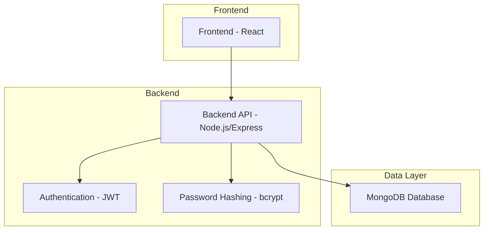
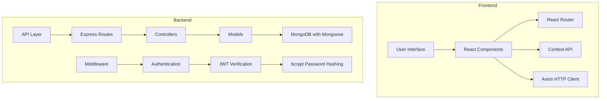
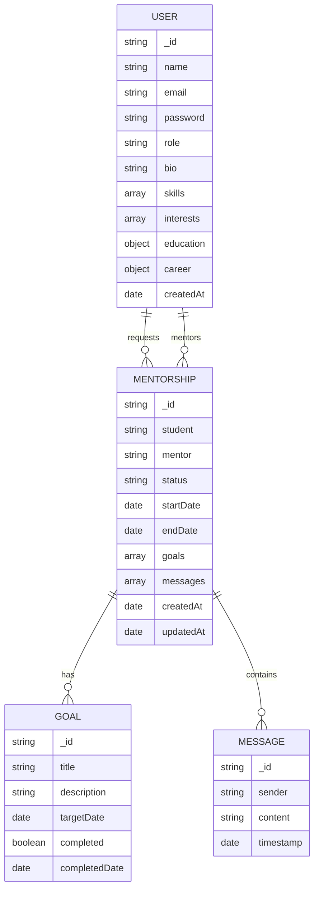
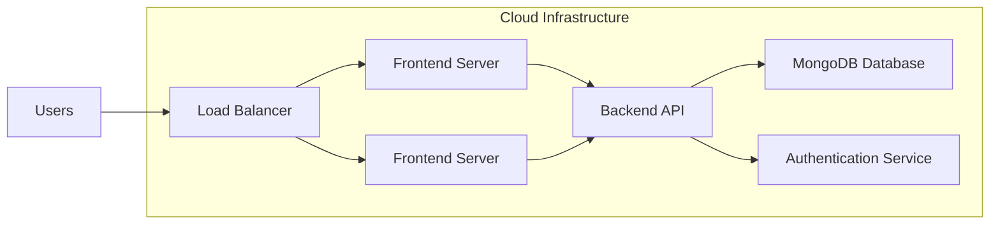

# MentorConnect Architecture

## System Overview



## Component Diagram



## Data Model



## Folder Structure

```
mentorconnect/
├── client/                 # React frontend application
│   ├── public/             # Static assets
│   ├── src/                # Source code
│   │   ├── components/     # Reusable UI components
│   │   ├── pages/          # Page components
│   │   ├── context/        # React context providers
│   │   ├── utils/          # Utility functions
│   │   ├── hooks/          # Custom hooks
│   │   ├── App.js          # Main application component
│   │   └── index.js        # Entry point
│   ├── package.json        # Frontend dependencies
│   └── README.md           # Frontend documentation
├── server/                 # Node.js backend application
│   ├── controllers/        # Request handlers
│   ├── models/             # Database models
│   ├── routes/             # API routes
│   ├── middleware/         # Custom middleware
│   ├── config/             # Configuration files
│   ├── server.js           # Main server file
│   ├── package.json        # Backend dependencies
│   └── .env                # Environment variables
├── package.json            # Root package.json with dev scripts
├── start-dev.js            # Development startup script
├── README.md               # Project documentation
└── ARCHITECTURE.md         # Architecture documentation
```

## Technology Stack

### Frontend
- **React.js**: Component-based UI library
- **React Router**: Client-side routing
- **Context API**: State management
- **Axios**: HTTP client for API requests
- **CSS3**: Styling and responsive design

### Backend
- **Node.js**: JavaScript runtime environment
- **Express.js**: Web application framework
- **MongoDB**: NoSQL database
- **Mongoose**: MongoDB object modeling
- **JWT**: JSON Web Tokens for authentication
- **bcryptjs**: Password hashing
- **dotenv**: Environment variable management

### Development Tools
- **npm**: Package manager
- **nodemon**: Development server with auto-restart
- **create-react-app**: React project scaffolding

## API Endpoints

### Authentication
```
POST   /api/auth/register     # User registration
POST   /api/auth/login        # User login
GET    /api/auth/profile      # Get user profile
```

### Users
```
GET    /api/users             # Get all users
GET    /api/users/:id         # Get user by ID
PUT    /api/users/profile     # Update user profile
```

### Mentorships
```
POST   /api/mentorships       # Create mentorship request
GET    /api/mentorships/requests  # Get mentorship requests
GET    /api/mentorships/student   # Get student mentorships
PUT    /api/mentorships/:id/accept  # Accept mentorship request
PUT    /api/mentorships/:id/reject  # Reject mentorship request
POST   /api/mentorships/:id/goals   # Add goal to mentorship
POST   /api/mentorships/:id/messages # Add message to mentorship
```

## Deployment Architecture

